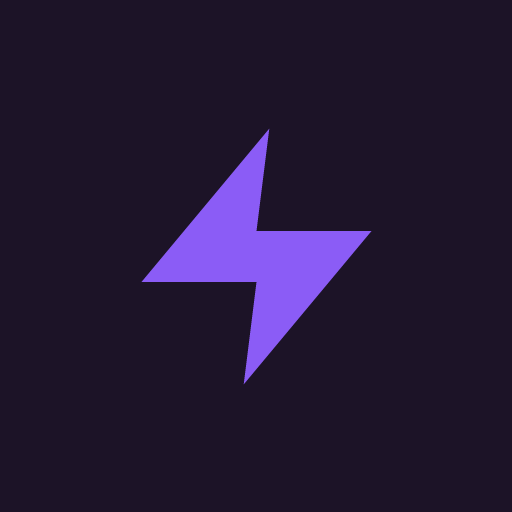
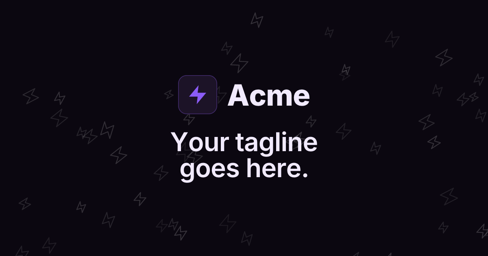
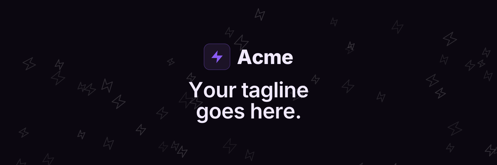
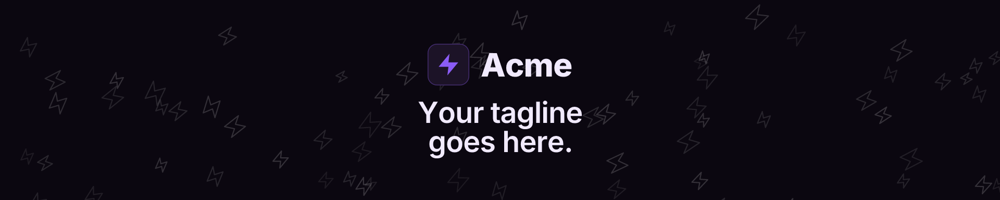
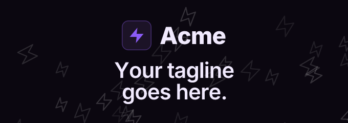
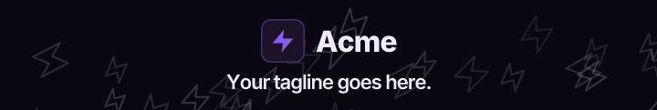

# Showcase

Every asset produced by [`examples/generate.ts`](../examples/generate.ts) — the placeholder
"Acme" brand, regenerated with `pnpm generate`. Nothing here is hand-tuned per platform beyond
picking icon/text sizes that fit each frame; the centering, gap and padding all come from
[`bannerFrame`](../src/layout.ts).

## Logo & app icon

| Logo | Apple touch icon | Favicon |
|---|---|---|
|  |  |  |
| `SPECS.LOGO_SQUARE` — 512×512 | `SPECS.APPLE_TOUCH_ICON` — 180×180 | `SPECS.FAVICON_32` — 32×32 |

Also generated: [`favicon.svg`](showcase/favicon.svg), [`favicon-16.png`](showcase/favicon-16.png) (16×16), [`favicon.ico`](showcase/favicon.ico) (multi-resolution, packed from the 16/32 PNGs).

## OG image

<br>
<sub><code>SPECS.OG</code> — 1200×630</sub>

## Twitter / X banner

<br>
<sub><code>SPECS.TWITTER_BANNER</code> — 1500×500</sub>

## Reddit banner

<br>
<sub><code>SPECS.REDDIT_BANNER</code> — 1920×384</sub>

## Discord banner

<br>
<sub><code>SPECS.DISCORD_BANNER</code> — 680×240</sub>

## LinkedIn banner

<br>
<sub><code>SPECS.LINKEDIN_BANNER</code> — 720×121</sub>

---

Regenerate all of the above with:

```sh
pnpm generate
```
